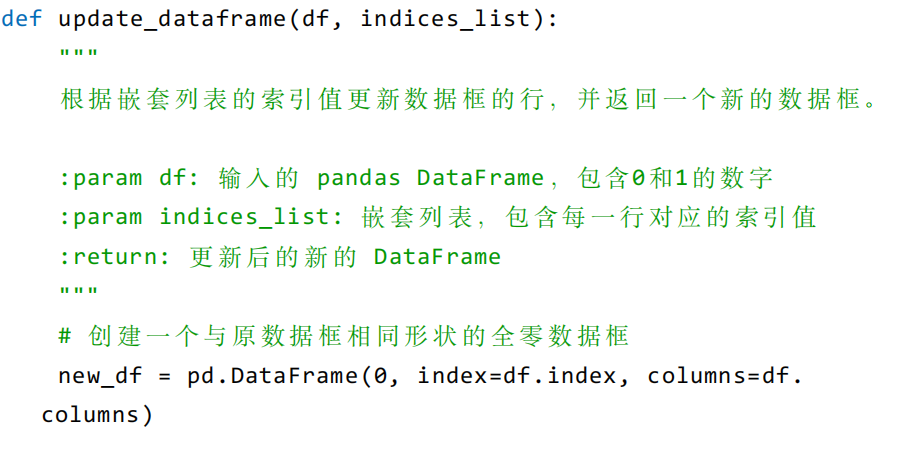

# 团队协作代码开发规范

## 示范

- 自定义函数必须说明该函数的作用、传入参数和返回值(如果有)，继承的方法可以根据实际情况增加说明。

### 1.1 目的
为规范团队代码开发过程，提高代码质量，降低维护成本，促进团队协作效率，特制定本规范。本规范参考华为团队协作代码开发标准，并结合团队实际情况制定。

### 1.2 适用范围
本规范适用于团队所有成员在项目开发过程中的代码编写、提交、评审、测试及维护等相关活动。

### 1.3 基本原则
- 一致性：团队成员遵循统一的规范进行代码开发
- 可读性：代码应清晰易懂，便于他人阅读和理解
- 可维护性：代码结构应清晰，便于后续修改和维护
- 可靠性：代码应经过充分测试，保证功能的正确性和稳定性
- 安全性：代码应考虑安全因素，防止安全漏洞

## 2. 代码编写规范

### 2.1 通用命名规范
- 标识符命名应清晰、明确，能够准确反映其含义和用途
- 变量名、函数名、方法名采用小驼峰命名法（lowerCamelCase），如：`userName`、`calculateTotal()`
- 类名、接口名采用大驼峰命名法（UpperCamelCase），如：`UserInfo`、`OrderService`
- 常量名全部大写，单词间用下划线分隔，如：`MAX_SIZE`、`DEFAULT_VALUE`
- 包名全部小写，不使用下划线，如：`com.company.project.module`
- 避免使用拼音、缩写（约定俗成的除外，如：`id`、`url`）和无意义的命名（如：`temp`、`data1`）

### 2.2 代码格式规范
- 缩进使用4个空格，不使用制表符（Tab）
- 每行代码长度不超过80个字符，超出时应进行合理换行
- 函数或方法的参数列表较长时，应每行只写一个参数
- 运算符前后应各加一个空格，如：`a + b`、`x = 5`
- 逗号后面应加一个空格，如：`func(a, b, c)`
- 空行的使用：
  - 类的不同成员之间加一个空行
  - 函数或方法内部逻辑块之间加一个空行
  - 文件末尾保留一个空行

### 2.3 注释规范
- 代码注释应准确、简洁，解释代码的用途、逻辑和注意事项
- 类、接口、函数、方法必须添加文档注释，说明其功能、参数、返回值、异常等信息
- 复杂的逻辑代码块应添加行内注释或块注释，解释其实现思路
- 注释应与代码保持同步更新，避免注释与代码不一致
- 避免添加无意义的注释（如：`// 声明变量i`）

### 2.4 代码结构规范
- 一个源文件只包含一个公共类或接口
- 类的成员顺序：静态变量、实例变量、构造方法、静态方法、实例方法
- 函数或方法的长度不宜过长，建议不超过80行，功能复杂的应拆分为多个函数或方法
- 避免深度嵌套的代码结构，建议嵌套层次不超过3层

## 3. 版本控制规范

### 3.1 分支管理
- 主分支（master/main）：存放正式发布的代码，保持稳定可运行状态
- 开发分支（develop）：团队日常开发的集成分支，包含下一个版本待发布的功能
- 功能分支（feature/*）：用于开发新功能，从develop分支创建，完成后合并回develop分支
- 发布分支（release/*）：用于版本发布准备，从develop分支创建，完成后合并到master和develop分支
- 修复分支（hotfix/*）：用于修复生产环境的紧急问题，从master分支创建，完成后合并到master和develop分支

### 3.2 提交规范
- 提交信息应清晰、准确，说明本次提交的内容和目的
- 提交信息格式：`[类型] 描述信息`，类型包括：feat（新功能）、fix（修复bug）、docs（文档更新）、style（代码格式调整）、refactor（代码重构）、test（测试相关）、chore（构建过程或辅助工具变动）
- 每次提交应只包含一个逻辑相关的修改，避免一次提交多个不相关的修改
- 提交前应进行代码自检，确保代码符合规范且能正常编译运行
- 定期从目标合并分支同步代码，减少合并冲突

### 3.3 代码合并规范
- 功能分支完成后，通过Pull Request/Merge Request发起合并请求
- 代码合并前必须经过至少一名团队成员的评审通过
- 合并前应确保所有自动化测试通过
- 合并时优先使用" Squash and merge "方式，使提交历史更清晰

## 4. 代码评审规范

### 4.1 评审准备
- 提交评审前，开发者应自行检查代码是否符合本规范及项目相关要求
- 确保提交的代码是完整的、可编译运行的
- 提供清晰的评审说明，包括功能描述、实现思路、测试情况等

### 4.2 评审内容
- 代码是否符合本规范的命名、格式、注释等要求
- 代码逻辑是否清晰、正确，是否存在潜在问题
- 代码是否有冗余、重复或可优化的地方
- 是否考虑了边界情况和异常处理
- 是否编写了必要的测试用例

### 4.3 评审流程
- 评审人收到评审请求后，应在一个工作日内进行评审
- 评审过程中发现问题时，应给出具体的修改建议
- 开发者根据评审意见进行修改后，再次提交评审
- 评审通过后，方可进行代码合并

## 5. 测试规范

### 5.1 单元测试
- 核心功能和复杂逻辑必须编写单元测试
- 单元测试应覆盖正常场景、边界场景和异常场景
- 单元测试的代码覆盖率应达到80%以上
- 单元测试应能独立运行，不依赖外部环境

### 5.2 集成测试
- 模块间接口交互需进行集成测试
- 集成测试应验证模块间协作的正确性
- 集成测试环境应尽可能接近生产环境

### 5.3 测试驱动开发
- 鼓励采用测试驱动开发（TDD）方式，先编写测试用例，再实现功能代码
- 功能修改或重构后，应重新运行相关测试用例，确保功能正确性

## 6. 文档规范

### 6.1 项目文档
- 项目应包含必要的文档：需求文档、设计文档、部署文档、用户手册等
- 文档应保持最新，与代码和功能同步更新
- 文档应清晰、准确、易于理解

### 6.2 接口文档
- 对外提供的接口必须编写接口文档
- 接口文档应包含接口名称、URL、请求方法、参数说明、返回值说明、错误码说明等
- 接口变更时，应及时更新接口文档

## 7. 安全规范

### 7.1 输入验证
- 对所有用户输入进行严格验证，防止注入攻击、跨站脚本攻击（XSS）等安全问题
- 验证内容包括数据类型、长度、格式、范围等

### 7.2 敏感信息处理
- 敏感信息（如密码、身份证号等）应进行加密存储和传输
- 避免在日志中记录敏感信息

### 7.3 权限控制
- 实现严格的权限控制机制，确保用户只能访问其有权限的资源
- 权限验证应在服务端进行，不能仅依赖客户端验证

## 8. 附则

### 8.1 规范执行
- 团队所有成员应严格遵守本规范
- 代码审查过程中应将本规范作为重要审查依据

### 8.2 规范更新
- 本规范将根据团队实际情况和技术发展进行定期修订和完善
- 规范的更新需经过团队讨论并达成一致

### 8.3 生效日期
- 本规范自发布之日起生效